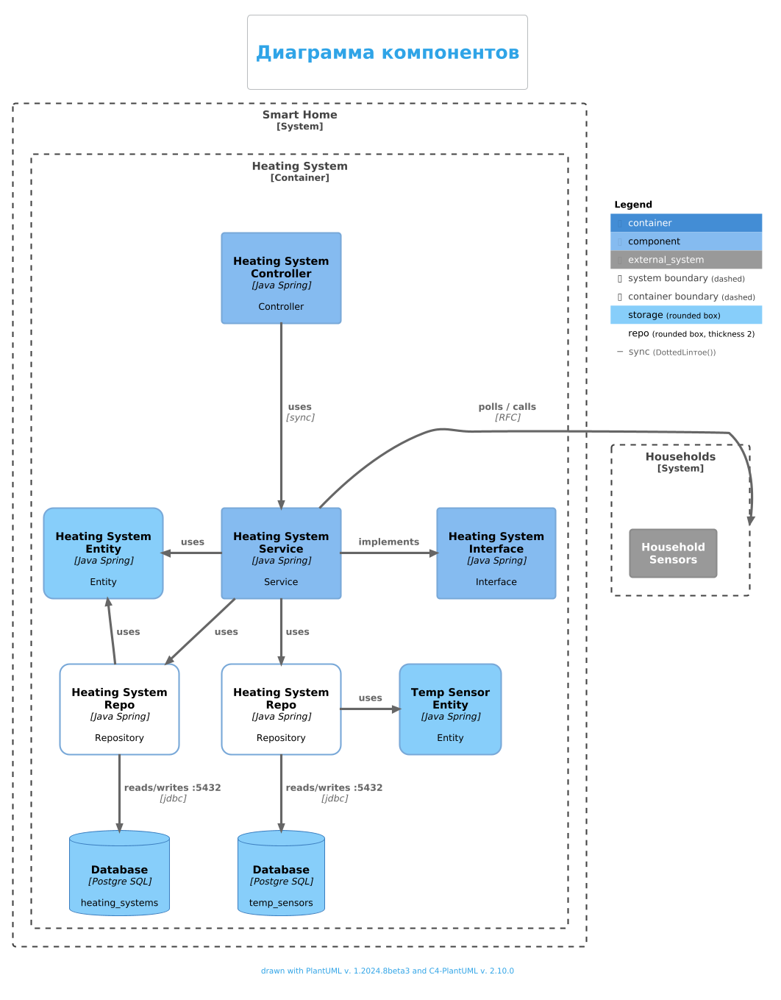

# Анализ и планирование

## Функциональность монолитного приложения

### Управление отоплением:
* Пользователи могут удалённо включать/выключать отопление в своих домах.
* Пользователи могут устанавливать желаемую температуру.
* Система автоматически поддерживает заданную температуру, регулируя подачу тепла.
### Мониторинг температуры:
* Система получает данные о температуре с датчиков, установленных в домах.
* Пользователи могут просматривать текущую температуру в своих домах через веб-интерфейс.

Самостоятельно подключить свой датчик к системе пользователь не может.
Каждая установка сопровождается выездом специалиста по подключению системы отопления в доме к текущей версии системы.

## Анализ архитектуры монолитного приложения

### Диаграмма контекста

### Диаграмма компонентов

### Архитектура:
Проект организован в соответствии со стандартной структурой Maven/Gradle проекта:

- **Основной класс приложения** аннотирован `@SpringBootApplication`.
- **Пакеты**:
    - `controller` - контроллеры для обработки HTTP-запросов.
    - `service` - сервисы для бизнес-логики.
    - `repository` - репозитории для доступа к базе данных.
    - `entity` - сущности JPA.
    - `dto` - объекты передачи данных (DTO).

## Зависимости

Проект использует следующие зависимости:

- Java 17
- Maven >=3.8.1 && <4.0.0
- `spring-boot-starter-web` - для создания веб-приложений.
- `spring-boot-starter-data-jpa` - для работы с JPA и базой данных.
- `postgresql` - драйвер для работы с PostgreSQL.
- `springfox-boot-starter` - для интеграции Swagger.
- `lombok` - для упрощения написания кода.
- `spring-boot-starter-test`, `spring-boot-testcontainers`, `junit-jupiter`, `testcontainers` - для тестирования.

- **Язык программирования:** `Java`.
- **СУБД:** `PostgreSQL`.
- **Взаимодействие:** Все взаимодействия между компонентами системы синхронны.
- **Характеристики:**
    - Монолитная архитектура.
    - Отсутствие микросервисов и асинхронных вызовов.
    - Сервер выполняет все управляющие функции и непосредственно взаимодействует с датчиками.

### Масштабируемость
- **Проблемы с масштабированием:**
    - Монолитная структура затрудняет добавление новых функций и модулей.
    - Система не поддерживает гибкое и динамическое подключение новых устройств.
- **Риски:**
    - Увеличение нагрузки на систему при добавлении новых домов и устройств приведёт к ухудшению производительности.

### Развертывание
- Развертывание текущей системы требует значительных усилий и часто требует вмешательства специалистов для установки и настройки.

## Заключение
Текущая монолитная архитектура и синхронное взаимодействие системы существенно ограничивают её способность к масштабированию и расширению функционала, что делает невозможным реализацию новой экосистемы умного поселка в рамках существующего решения.

