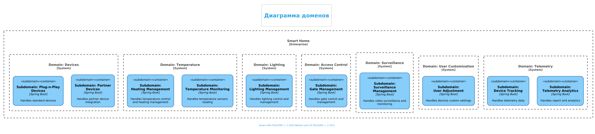

# Описание доменов

## Диаграмма доменов Приложения "smart-home"

### Домен: Устройства
- **Поддомен: Устройства Plug-n-Play**
    - **Технология**: `Spring Boot`
    - **Описание**: Управляет стандартными устройствами из экосистемы умного дома.

- **Поддомен: Устройства партнеров**
    - **Технология**: `Spring Boot`
    - **Описание**: Интегрирует и управляет устройствами от сторонних поставщиков.

### Домен: Температура
- **Поддомен: Управление отоплением**
    - **Технология**: `Spring Boot`
    - **Описание**: Управляет системами отопления устанавливает настройки температуры.

- **Поддомен: Мониторинг температуры**
    - **Технология**: `Spring Boot`
    - **Описание**: Отслеживание тепературы, считывание данных с датчиков температуры.

### Домен: Освещение
- **Поддомен: Управление освещением**
    - **Технология**: `Spring Boot`
    - **Описание**: Управляет освещением в умном доме.

### Домен: Система контроля доступа (СКД)
- **Поддомен: Управление воротами**
    - **Технология**: `Spring Boot`
    - **Описание**: Управляет воротами и системами доступа.

### Домен: Видеонаблюдение
- **Поддомен: Управление видеонаблюдением**
    - **Технология**: `Spring Boot`
    - **Описание**: Управляет системами видеонаблюдения и мониторинга.

### Домен: Персонализация пользователя
- **Поддомен: Настройки пользователя**
    - **Технология**: `Spring Boot`
    - **Описание**: Устанавливает настройки для устройств пользователей.

### Домен: Телеметрия
- **Поддомен: Отслеживание устройств**
    - **Технология**: `Spring Boot`
    - **Описание**: Управляет и отслеживает данные телеметрии от устройств.

- **Поддомен: Аналитика телеметрии**
    - **Технология**: `Spring Boot`
    - **Описание**: Предоставляет аналитику и отчеты на основе данных телеметрии.
