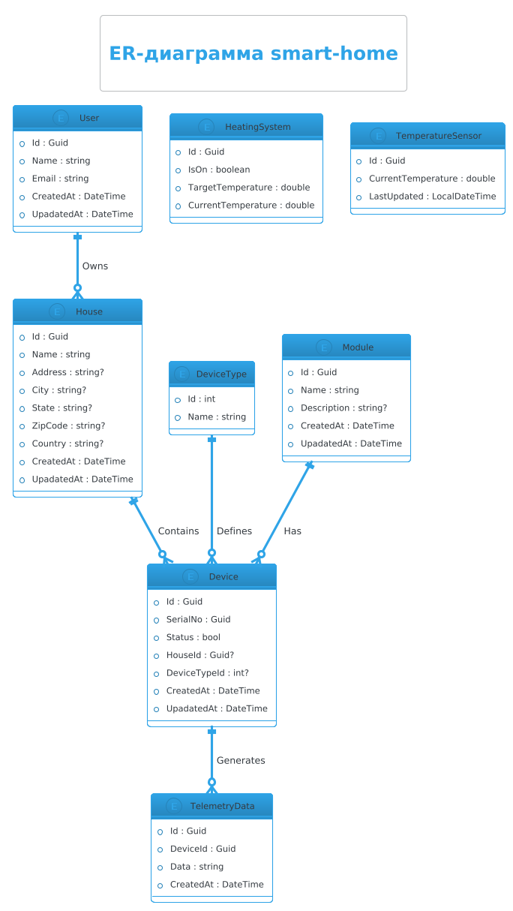

# ER диаграмма Приложения ""smart-home""

Документ описывает сущности и их атрибуты для Приложения ""smart-home"", которое:

* собирает телеметрические данные из домов 
* управляет устройствами пользователей, такими как температура, освещение и другие модули умного дома.

## ER диаграмма

## Сущности

1. **Пользователь (User)**
    - **Id**: Идентификатор пользователя (Guid)
    - **Name**: Имя пользователя (string)
    - **Email**: Электронная почта пользователя (string)
    - **CreatedAt**: Дата и время создания записи (DateTime)
    - **UpadatedAt**: Дата и время изменения записи (DateTime)

2. **Устройство (Device)**
    - **Id**: Идентификатор устройства (Guid)
    - **SerialNo**: Серийный номер устройства (Guid)
    - **Status**: Статус устройства (bool)
    - **HouseId**: Идентификатор дома, к которому привязано устройство (Guid?)
    - **DeviceTypeId**: Идентификатор типа устройства (int?)
    - **CreatedAt**: Дата и время создания записи (DateTime)
    - **UpadatedAt**: Дата и время изменения записи (DateTime)

3. **Тип устройства (DeviceType)**
    - **Id**: Идентификатор типа устройства (int)
    - **Name**: Название типа устройства (string)

4. **Дом (House)**
    - **Id**: Идентификатор дома (Guid)
    - **Name**: Название дома (string)
    - **Address**: Адрес дома (string?)
    - **City**: Город (string?)
    - **State**: Штат (string?)
    - **ZipCode**: Почтовый индекс (string?)
    - **Country**: Страна (string?)    
    - **CreatedAt**: Дата и время создания записи (DateTime)
    - **UpadatedAt**: Дата и время изменения записи (DateTime)

5. **Модуль (Module)**
    - **Id**: Идентификатор модуля (Guid)
    - **Name**: Название модуля (string)
    - **Description**: Описание модуля (string?)
    - **CreatedAt**: Дата и время создания записи (DateTime)
    - **UpadatedAt**: Дата и время изменения записи (DateTime)

6. **Система отопления (HeatingSystem)**
    - **Id**: Идентификатор системы отопления (Guid)
    - **IsOn**: Включена ли система (boolean)
    - **TargetTemperature**: Целевая температура (double)
    - **CurrentTemperature**: Текущая температура (double)

7. **Датчик температуры (TemperatureSensor)**
    - **Id**: Идентификатор датчика температуры (Guid)
    - **CurrentTemperature**: Текущая температура (double)
    - **LastUpdated**: Дата и время последнего обновления (LocalDateTime)

8. **Телеметрия (TelemetryData)**
    - **Id**: Идентификатор телеметрии (Guid)
    - **DeviceId**: Идентификатор устройства, к которому относится телеметрия (Guid)
    - **Data**: Данные телеметрии (string)
    - **CreatedAt**: Дата и время создания записи (DateTime) 

## Связи между сущностями

- **Пользователь** (User) - **Дом** (House): Один пользователь может владеть несколькими домами. (one to many)
- **Дом** (House) - **Устройство** (Device): Один дом может содержать несколько устройств.(one to many)
- **Тип устройства** (DeviceType) - **Устройство** (Device): Один тип устройства может быть связан с несколькими устройствами.(one to many)
- **Устройство** (Device) - **Телеметрия** (TelemetryData): Одно устройство может генерировать множество записей телеметрии.(one to many)
- **Модуль** (Module) - **Устройство** (Device): Один модуль может быть связан с несколькими устройствами.(one to many)
